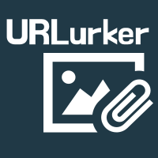

  

<h1 align="center">
  URLurker
</h1>

Streaming tool web app, built to help streamers engage with their audience. Safely view an image for the page contents of links shared from viewers.

Continue your conversations with context and let your viewrs know what they share doesn't go unnoticed.

Open and welcome to contributions.

## Getting Started

### Dependencies

- ApiFlash
  We use serverless functions to call the APIFlash api to request screenshots for the submitted urls.

You will need to sign up for a free access key and add the access key to your environment variables.

View [APIFlash](https://apiflash.com/)

- Netlify
  This project uses serverless functions to interact with the api that obtains screenshot data.

A super simple netlify.toml file, like the one on this project, is required for serverless functionality.

If you do not already have a Netlify account, you will need to sign up for a free account, serverless functions are available on all plans.

More on [Netlify Serverless Functions](https://docs.netlify.com/functions/overview/)

- Netlify CLI (optional)
  To help with local development, you can optionally install the netlify cli.

Upon installation, you'll have access to any serverless functionality in your code locally.

View the [Netlify CLI Docs](https://docs.netlify.com/cli/get-started/)
